# COVID-19 Analysis

This project is inspired by Alex Freberg’s Data Analyst Portfolio Project. The purpose of this project is to explore the global data on COVID-19 deaths and vaccinations from the perspective a data analyst.

## Table of contents
- [Dataset](#dataset)
- [Data Analysis](#data-analysis)
    - [1. Have an overview of the dataset](#1-have-an-overview-of-the-dataset)
    - [2. Select key variables in the dataset](#2-select-key-variables-in-the-dataset)
    - [3. Analysis by Location](#3-analysis-by-location)
    - [4. Analysis by Continent](#4-analysis-by-continent)
    - [5. Analysis by Date](#5-analysis-by-date)
    - [6. Analysis by Vaccinations](#6-analysis-by-vaccinations)
- [Data Visualization](#data-visualization)
    - [1. Prepare the data for visualization](#1-prepare-the-data-for-visualization)
    - [2. Visualize the data](#2-visualize-the-data)

*Quick Links:* 
- [Github SQL Code for Data Exploration](https://github.com/alitanguyen/Covid-19-Analysis/blob/main/Covid_Project_Data_Exploration.sql)
- [Github SQL Code for Data Visualization](https://github.com/alitanguyen/Covid-19-Analysis/blob/main/Covid_Project_Data_Visualization.sql) 
- [Tableau Dashboard](https://public.tableau.com/app/profile/anh.nguyen1487/viz/CovidDashboard_17124002483410/Dashboard1)

## **Dataset**

The dataset is publicly available **[here](https://ourworldindata.org/covid-deaths).** 

The original dataset is split into 2 CSV files including: 

- `CovidDeaths` - It provides data on global COVID-19 cases and deaths
- `CovidVaccinations` - It  provides data on global COVID-19 vaccinations

 I used Microsoft SQL Server to analyze the data then created a dashboard in Tableau.   

## **Data Analysis**

### **1. Have an overview of the dataset**

After importing the dataset into SQL, I started my first SQL query on the two tables. The following two queries gave an overall view of all records in the tables ordered by location and date.

```sql
SELECT *
FROM PortfolioProject..CovidDeaths
ORDER BY location, date;
```

```sql
SELECT *
FROM PortfolioProject..CovidVaccinations
ORDER BY location, date;
```
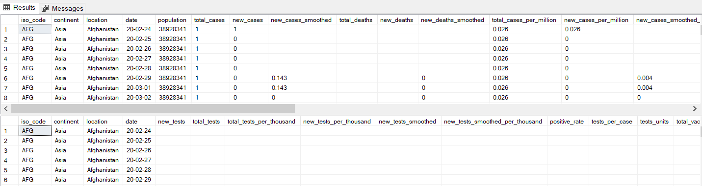


### **2. Select key variables in the dataset**

I focused on the table `CovidDeaths` first. Hence, I selected some key variables from this table including `location`, `date`, `total_cases`, `new_cases`, `total_deaths`, `population` for further calculations.

```sql
SELECT location, date, total_cases, new_cases, total_deaths, population
FROM PortfolioProject..CovidDeaths
ORDER BY location, date;
```

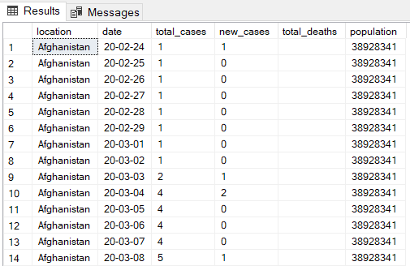

### **3. Analysis by Location**

**3.1 Calculate the COVID death rate** 

In order to know the percentage of COVID death rate, I divided the `total_deaths` by the `total_cases` . At first, I input the following query. 

```sql
SELECT location, date, total_cases, total_deaths,
(total_deaths/total_cases)*100 AS death_rate
FROM PortfolioProject..CovidDeaths
WHERE continent IS NOT NULL
ORDER BY location, date;
```

But the result showed *“Operand data type varchar is invalid for divide operator”*. It indicated that one of the operands involved in the divide operation is of type VARCHAR, which is a string data type and cannot be used in arithmetic operations like division. Therefore, I needed to `CONVERT` both operands into `FLOAT` which is a numeric data type. 

Also, I used `NULLIF` to handle this case where `total_cases` is 0, preventing division by zero. If `total_cases` is 0, `NULLIF` returns NULL, which causes the division to result in NULL rather than an error. 

Below is the new query. 

```sql
SELECT location, date, total_cases, total_deaths,
(CONVERT(FLOAT, total_deaths)/NULLIF(CONVERT(FLOAT, total_cases), 0))*100 AS death_rate
FROM PortfolioProject..CovidDeaths
WHERE continent IS NOT NULL
ORDER BY location, date;
```

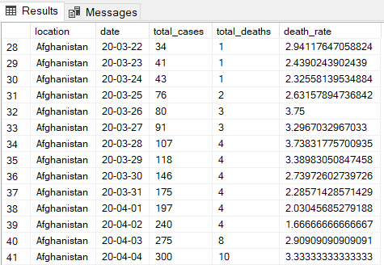 </br>

**3.2 Calculate the COVID infection rate by population** 

```sql
SELECT location, date, population, total_cases,
(CONVERT(FLOAT, total_cases)/NULLIF(CONVERT(FLOAT, population), 0))*100 AS infection_rate
FROM PortfolioProject..CovidDeaths
WHERE continent IS NOT NULL
ORDER BY location, date;
```

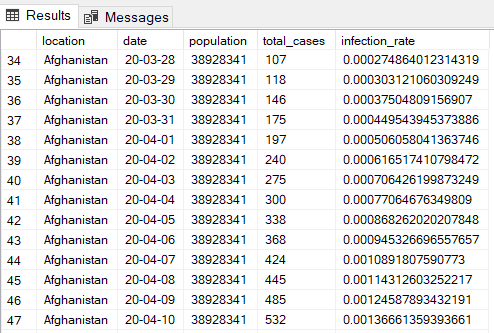 </br>

**3.3 Calculate the highest infection count and the highest infection rate by population**

```sql
SELECT location, population,
MAX(CONVERT (FLOAT, total_cases)) AS highest_infection_count,
MAX((CONVERT(FLOAT, total_cases)/NULLIF(CONVERT(FLOAT, population), 0)))*100 AS highest_infection_rate
FROM PortfolioProject..CovidDeaths
WHERE continent IS NOT NULL
GROUP BY location, population
ORDER BY highest_infection_rate DESC;
```

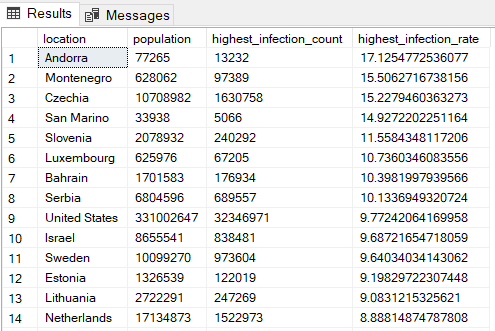 </br>

**3.4** **Calculate the highest death count and the highest death rate by population**

```sql
SELECT location,
MAX(CONVERT (FLOAT, total_deaths)) AS highest_death_count,
MAX((CONVERT(FLOAT, total_deaths)/NULLIF(CONVERT(FLOAT, population), 0)))*100 AS highest_death_rate
FROM PortfolioProject..CovidDeaths
WHERE continent IS NOT NULL
GROUP BY location
ORDER BY highest_death_rate DESC;
```

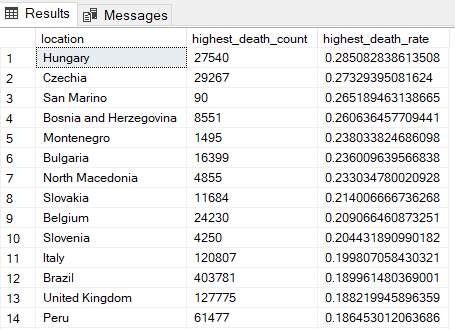 </br>

### **4. Analysis by Continent**

**4.1 Calculate the highest infection count and rate and the highest death count and rate by population**

```sql
SELECT continent,
MAX(CONVERT(FLOAT, total_cases)) AS highest_infection_count,
MAX(CONVERT(FLOAT, total_deaths)) AS highest_death_count,
MAX((CONVERT(FLOAT, total_cases)/NULLIF(CONVERT(FLOAT, population), 0)))*100 AS highest_infection_rate,
MAX((CONVERT(FLOAT, total_deaths)/NULLIF(CONVERT(FLOAT, population), 0)))*100 AS highest_death_rate
FROM PortfolioProject..CovidDeaths
WHERE continent IS NOT NULL
GROUP BY continent
ORDER BY highest_death_rate DESC;
```

 </br>

### **5. Analysis by Date**

**5.1 Calculate the total new cases, the total new deaths and the death percentage**

```sql
SELECT date,
SUM(CONVERT(FLOAT, new_cases)) AS total_new_cases,
SUM(CONVERT(FLOAT, new_deaths)) AS total_new_deaths,
(SUM(CONVERT(FLOAT, new_deaths))/SUM(NULLIF(CONVERT(FLOAT, new_cases),0)))*100 AS death_perc
FROM PortfolioProject..CovidDeaths
WHERE continent IS NOT NULL
GROUP BY date
ORDER BY date;
```

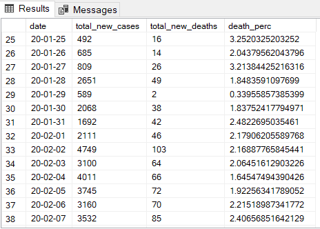 

### **6. Analysis by Vaccinations**

**6.1 Calculate the rolling vaccinations by location and date**

I used `JOIN` statement to join `CovidDeaths` and `CovidVaccinations` together. 

The query below calculated a rolling sum of new vaccinations for each location, where the sum restarts for each location and the ordering is based on the date within each location.

```sql
SELECT dea.continent, dea.location, dea.date, dea.population, vac.new_vaccinations,
SUM(CONVERT(FLOAT,vac.new_vaccinations)) OVER (PARTITION BY dea.location ORDER BY dea.location,dea.date) AS rolling_vaccinations
FROM PortfolioProject..CovidDeaths AS dea
JOIN PortfolioProject..CovidVaccinations AS vac
ON dea.location = vac.location
AND dea.date = vac.date
WHERE dea.continent IS NOT NULL
ORDER BY dea.location, dea.date;
```

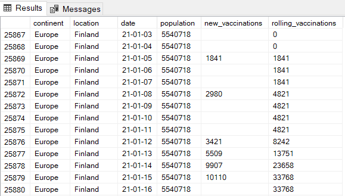 </br>

**6.2 Calculate the rolling vaccinations and the vaccination rate by population**

```sql
-- Use CTE
WITH PopvsVac
AS
(
SELECT dea.continent, dea.location, dea.date, dea.population, vac.new_vaccinations,
SUM(CONVERT(FLOAT,vac.new_vaccinations)) OVER (PARTITION BY dea.location ORDER BY dea.location,dea.date) AS rolling_vaccinations
FROM PortfolioProject..CovidDeaths AS dea
JOIN PortfolioProject..CovidVaccinations AS vac
ON dea.location = vac.location
AND dea.date = vac.date
WHERE dea.continent IS NOT NULL
)

SELECT *, (CONVERT(FLOAT, rolling_vaccinations)/NULLIF((CONVERT(FLOAT, population)), 0))*100 AS vac_rate
FROM PopvsVac;
```

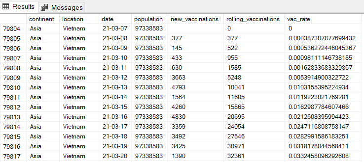 </br>

**6.3 Create TEMP TABLE**

The following query created a temp table to achieve the same outcome as the previous query. 

```sql
-- Create TEMP TABLE 
Create TEMP TABLE
DROP TABLE IF EXISTS #Population_Vaccinated_Rate;
CREATE TABLE #Population_Vaccinated_Rate 
(
continent NVARCHAR(255),
location NVARCHAR(255),
date NVARCHAR(255),
population FLOAT,
new_vaccinations FLOAT,
rolling_vaccinations FLOAT
);

-- Insert into TEMP TABLE
INSERT INTO #Population_Vaccinated_Rate
SELECT dea.continent, dea.location, dea.date, dea.population,vac.new_vaccinations,
SUM(CONVERT(FLOAT, vac.new_vaccinations)) OVER (PARTITION BY dea.location ORDER BY dea.location, dea.date) AS rolling_vaccinations

FROM PortfolioProject..CovidDeaths AS dea
JOIN PortfolioProject..CovidVaccinations AS vac
ON dea.location = vac.location
AND dea.date = vac.date
WHERE dea.continent IS NOT NULL;
```

```sql
-- Calculate vaccination rate by population
SELECT *,
(CONVERT(FLOAT, rolling_vaccinations) / NULLIF((CONVERT(FLOAT, population)), 0)) * 100 AS vac_rate
FROM #Population_Vaccinated_Rate;
```

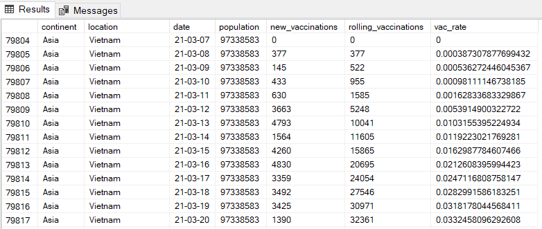

## **Data visualization**

### **1. Prepare the data for visualization**

Following Alex’s instruction, I modified 4 queries from the above analysis to prepare data for visualization. The results were then saved into 4 separate Excel files. 

**1.1 Calculate the total new cases, the total new deaths and the death percentage worldwide**

```sql
SELECT SUM(CONVERT(FLOAT, new_cases)) AS total_new_cases,
SUM(CONVERT(FLOAT, new_deaths)) AS total_new_deaths,
(SUM(CONVERT(FLOAT, new_deaths))/SUM(NULLIF(CONVERT(FLOAT, new_cases),0)))*100 AS death_perc
FROM PortfolioProject..CovidDeaths
WHERE continent IS NOT NULL;
```

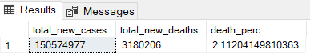 </br>

**1.2 Calculate the total death count per continent**

```sql
SELECT continent,
SUM(CONVERT(FLOAT, new_deaths)) AS total_death_count
FROM PortfolioProject..CovidDeaths
WHERE continent IS NOT NULL
AND location not IN ('World', 'European Union', 'International')
GROUP BY continent
ORDER BY total_death_count DESC;
```

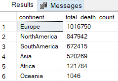

**1.3 Calculate the highest infection count and the highest infection rate by population** 

```sql
SELECT location, population,
MAX(CONVERT (FLOAT, total_cases)) AS highest_infection_count,
MAX((CONVERT(FLOAT, total_cases)/NULLIF(CONVERT(FLOAT, population), 0)))*100 AS highest_infection_rate
FROM PortfolioProject..CovidDeaths
WHERE continent IS NOT NULL
GROUP BY location, population
ORDER BY highest_infection_rate DESC;
```

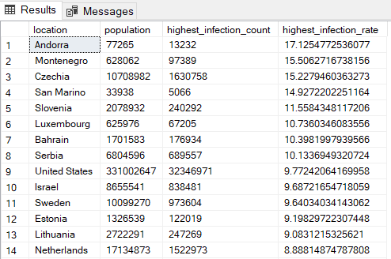

After saving the result to Excel file, I replaced all NULL values in this table with 0, which is a numeric data type, to ensure Tableau interpreted the data correctly and avoided mistaking NULL values for strings. 

**1.4 Calculate the daily highest infection count and the highest infection rate by population**

```sql
SELECT location, population, date,
MAX(CONVERT (FLOAT, total_cases)) AS highest_infection_count,
MAX((CONVERT(FLOAT, total_cases)/NULLIF(CONVERT(FLOAT, population), 0)))*100 AS highest_infection_rate
FROM PortfolioProject..CovidDeaths
WHERE continent IS NOT NULL
GROUP BY location, population, date
ORDER BY highest_infection_rate DESC;
```

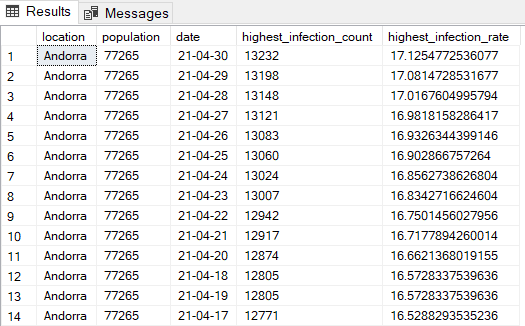

I also replaced all NULL values in this table with 0 before importing to Tableau. 

### **2. Visualize the data**

I imported four Excel files to Tableau for data visualization. 

Below is my final dashboard. You can also view it [here](https://public.tableau.com/app/profile/anh.nguyen1487/viz/CovidDashboard_17124002483410/Dashboard1). 

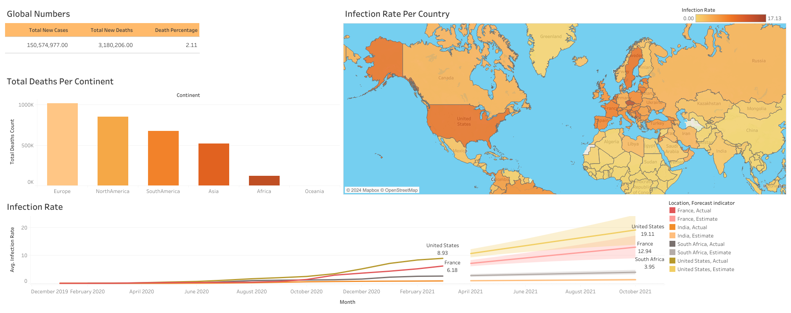